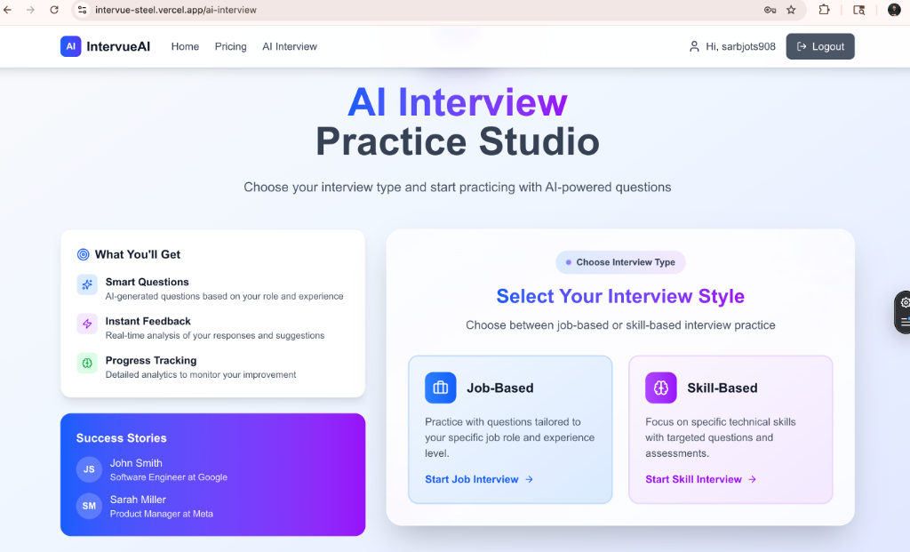
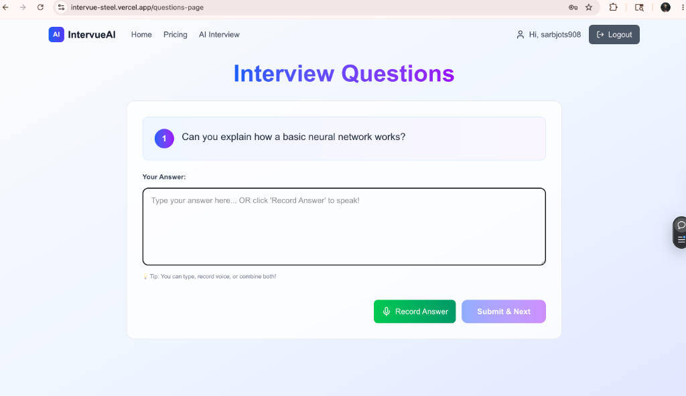
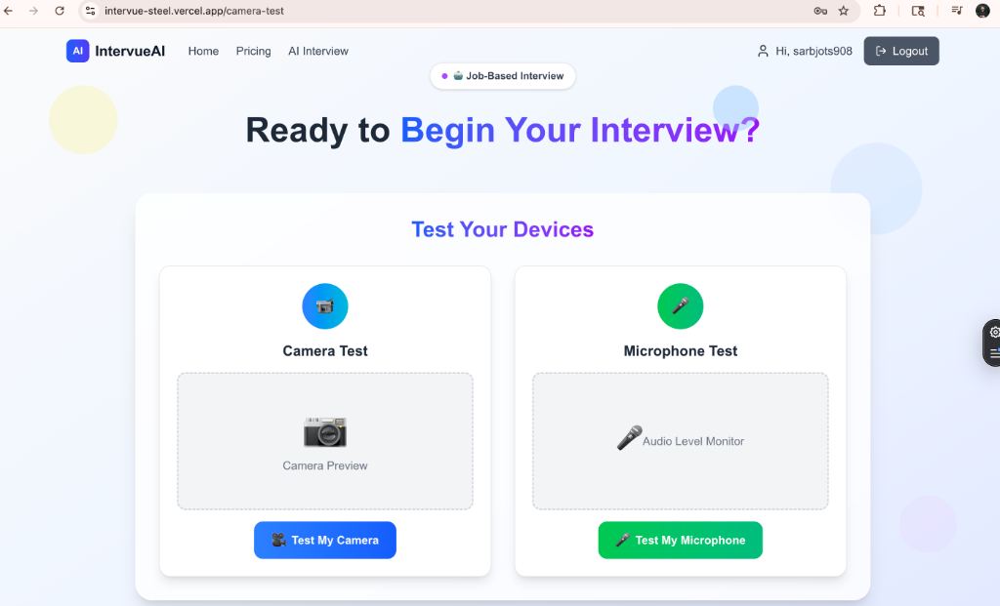
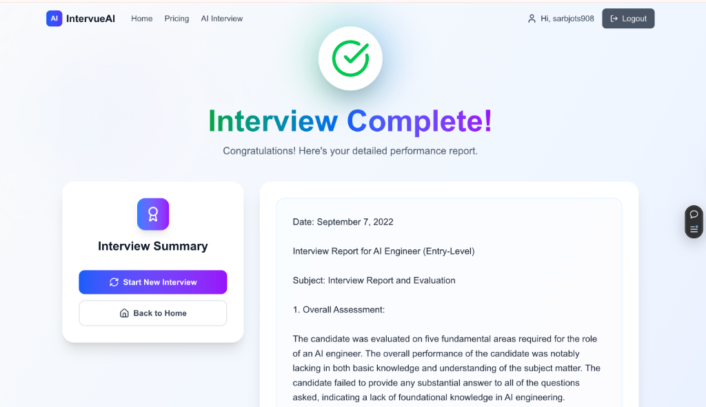
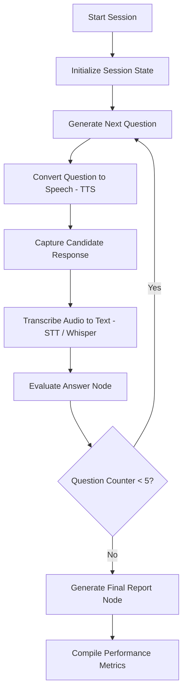

# IntervueAI — Generative AI Interview Practice Studio

> **IntervueAI** is a production-ready, full-stack AI-powered mock interview application. It simulates realistic, role-specific, and skill-specific technical interviews using conversational AI agents, real-time voice processing, and detailed candidate feedback reports.

---

## 🖼️ Application Screenshots

| Job & Experience Selection | Real-Time AI Interview Studio |
|:---:|:---:|
|  |  |

| Webcam & Audio Check | Detailed Evaluation Report |
|:---:|:---:|
|  |  |

---

## 🚀 Key Technologies & Skills Showcased

### **Generative AI & Agentic Orchestration**
* **LangGraph (LangChain)**: Orchestrates the multi-turn interview flow using a compiled state machine graph. Manages state transitions, question counters, answer grading nodes, and report generation dynamically.
* **LLM Integration**: Utilizing OpenAI's advanced models (`gpt-4o`) for context-aware technical assessment and constructive evaluation feedback.

### **Voice Processing (TTS / STT)**
* **Speech-to-Text (STT)**: Transcribes candidate responses in real time using OpenAI's **Whisper (`whisper-1`)** API via stream buffer uploads.
* **Text-to-Speech (TTS)**: Converts AI questions to high-fidelity audio using the OpenAI **TTS (`tts-1`)** engine.

### **Robust Backend Engine**
* **FastAPI**: High-performance, asynchronous web gateway utilizing Pydantic for request validation.
* **SQLAlchemy ORM**: Implements database models and session handling ready for relational databases like **SQLite**.
* **Firebase Admin Security**: Protects API routes by verifying Firebase JSON Web Tokens (JWT) client-side in the request headers (`Authorization: Bearer <token>`).

### **Modern Frontend UX**
* **Next.js**: Clean, responsive layout leveraging Next.js App Router conventions and Client Component rendering.
* **TailwindCSS**: Sleek, modern typography, glassmorphism designs, hover micro-animations, and full dark-mode harmony.
* **Web Device Integration**: Utilizes browser MediaDevices API for real-time webcam and microphone status checks before launching interviews.

---

## 🛠️ System Architecture Flow

The following Mermaid diagram outlines the state-machine workflow engineered with **LangGraph**:



---

## 📁 Repository Directory Structure

```bash
my-projects/
├── AI-Interviewer/               # FastAPI Backend Service
│   ├── dependencies/             # Authentication & Firebase dependencies
│   ├── router/                   # Session & Audio API routes
│   ├── schema/                   # Pydantic schemas for payload validation
│   ├── llm_langgraph.py          # LangGraph state machine workflow
│   ├── llm.py                    # LLM configuration and custom prompts
│   └── main.py                   # FastAPI server entry point
│
└── IntervueAI-Frontend/          # Next.js React Frontend Application
    ├── app/                      # Page components (Jobs, Skills, Camera Test, Interview Studio)
    │   └── _components/          # Shared components (Layout, ProtectedRoute, Navigation)
    └── public/                   # Static assets & icons
```

---

## 💻 API Service Endpoints

| Method | Endpoint | Description | Auth Required |
|:---|:---|:---|:---:|
| `POST` | `/sessions` | Creates a new interview session state machine. | Yes |
| `GET` | `/sessions/{id}` | Fetches the current state of the interview session. | Yes |
| `POST` | `/sessions/{id}/answers` | Submits candidate answer, evaluates it, and generates next question. | Yes |
| `GET` | `/sessions/{id}/final_report` | Compiles evaluation report with scores and suggestions. | Yes |
| `POST` | `/sessions/tts` | Synthesizes text prompt into MP3 audio stream. | Yes |
| `POST` | `/sessions/stt` | Transcribes multipart audio payload to text. | Yes |
